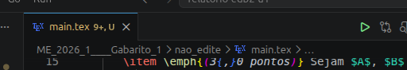

# Relatório de Estruturas de Dados Básicas II - Unidade 1

## Como instalar LaTeX e Como Gerar o PDF

Se você quer encher seu computador de pacotes provavelmente inúteis, digite no terminal: 

```bash
sudo apt update
sudo apt install texlive-full
```

Caso não queira, descubra sozinho quais pacotes são necessários! 

Depois disso, é só desabilitar as extensões de exibição de pdf no vscode, porque a extensão **LaTeX Workshop** já possui um leitor de PDF embutido (que é excelente, pois permite clicar no código e pular para a parte exata no PDF e vice-versa, chamado de SyncTeX). Como você também tem a extensão vscode-pdf instalada, elas entram em conflito quando você clica em um arquivo .pdf na barra lateral.

- **Para compilar: clique no play verde.**



- **Para gerar o arquivo em pdf: `Ctrl` + `Alt` + `V`**

**OBS:** Uma vez gerado o arquivo em pdf, você só precisa recompilar após as alterações para ver no pdf.

## Link do Artigo
[A Study on Contrast and Comparison between Bellman-Ford algorithm and Dijkstra's Algorithms](https://www.researchgate.net/publication/209423960_A_Study_on_Contrast_and_Comparison_between_Bellman-Ford_algorithm_and_Dijkstra%27s_Algorithms)

## Hiperlink para o Arquivo do Artigo

[A Study on Contrast and Comparison between Bellman-Ford algorithm and Dijkstra's Algorithms](A_Study_on_Contrast_and_Comparison_between_Bellman-Ford_algorithm_and_Dijkstras_Algorithms.pdf)

## Parte 1 - Divisão do Trabalho

Com base nas instruções do documento "Trabalho_1_EDB2_Analise_Empirica_de_Algoritmos.pdf" e no contexto do artigo "A_Study_on_Contrast_and_Comparison_between_Bellman-Ford_algorithm_and_Dijkstras_Algorithms.pdf", o trabalho em grupo pode ser dividido em 4 componentes principais de responsabilidades.

Aqui está uma proposta estruturada de divisão:

**Componente 1: Revisão de Literatura e Fundamentação Teórica - Integrante: Pedro**

* **Objetivo:** Extrair, compreender e documentar as informações do artigo base.


* **Responsabilidades:**
* Identificar e explicar o problema central resolvido pelos algoritmos: o roteamento de caminhos mais curtos (busca do caminho mais curto a partir de uma única origem).


* Descrever o funcionamento e os contextos de aplicação dos dois algoritmos selecionados: Bellman-Ford e Dijkstra.


* Documentar a complexidade teórica assintótica indicada pelo artigo: $O(\vert{}V\vert{}^2)$ para o algoritmo de Dijkstra e $O(\vert{}V\vert{} \times \vert{}E\vert{})$ para o Bellman-Ford.


* Explicar as diferenças teóricas cruciais, como o fato de que Dijkstra não lida com arestas de peso negativo, enquanto Bellman-Ford consegue lidar (desde que não haja ciclos negativos).


**Componente 2: Implementação e Adaptação do Código - Integrante: Letícia**

* **Objetivo:** Traduzir os algoritmos do artigo para código funcional e prepará-los para o experimento prático.


* **Responsabilidades:**
* Reproduzir e compreender a lógica dos pseudocódigos e trechos de código em C fornecidos no artigo para os dois algoritmos.


* Adaptar o programa para permitir que o tamanho da entrada seja variado progressivamente.


* Definir exatamente o que representa a entrada $n$ no experimento. Baseado no artigo, $n$ representará o número de vértices/nós (e opcionalmente arestas, considerando o caso base do artigo onde $m = n$).


* Garantir que a geração da entrada (ex: criação dos grafos) não seja contabilizada no tempo de execução do algoritmo.


**Componente 3: Execução do Experimento e Coleta de Dados (Medição) - Integrante: Álvaro**

* **Objetivo:** Rodar os algoritmos adaptados e realizar as medições empíricas de tempo de forma controlada.


* **Responsabilidades:**
* Aumentar o valor de $n$ (tamanho do grafo) de forma sistemática para gerar valores suficientes que tornem o crescimento observável.


* Medir o tempo de execução do algoritmo de Bellman-Ford e do algoritmo de Dijkstra para cada tamanho de $n$.


* Realizar várias execuções (repetições) para cada tamanho de entrada $n$ e calcular a média de tempo, reduzindo a influência de variações externas da máquina.


* Armazenar todos os dados brutos em uma tabela (n, tempos obtidos, médias calculadas) e documentar as configurações da máquina utilizada.


**Componente 4: Análise dos Resultados e Elaboração do Relatório - Integrante: Renan**

* **Objetivo:** Comparar os dados obtidos com a teoria e compilar as descobertas no formato de entrega exigido.


* **Responsabilidades:**
* Gerar o gráfico obrigatório de "Tempo de execução x Tamanho da entrada n" comparando as curvas de Bellman-Ford e Dijkstra.


* Interpretar os resultados para validar a afirmação do artigo de que, embora ambos possuam um crescimento de $O(n^2)$ (para o caso onde arestas = nós), o Bellman-Ford requer mais tempo de execução na prática.


* Verificar e discutir se o crescimento empírico acompanha a curva assintótica esperada, respondendo à pergunta central: "Como o tempo de execução cresce quando o tamanho da entrada aumenta?".


* Redigir o relatório final em PDF seguindo a estrutura exigida (Introdução, Algoritmos e fontes, Metodologia, Análise teórica, Resultados, Discussão e Conclusão) e organizar o código-fonte para a entrega.

## Parte 2 - Divisão do Trabalho

Para complementar a divisão de tarefas, podemos mapear as seções obrigatórias do relatório (descritas na seção 12 do documento "Trabalho_1_EDB2_Analise_Empirica_de_Algoritmos.pdf") diretamente para os 4 componentes propostos.

Dessa forma, cada membro (ou subgrupo) fica responsável por redigir as partes do relatório correspondentes ao seu trabalho prático:

**Componente 1: Revisão de Literatura e Fundamentação Teórica - Integrante: Pedro**

* **Responsabilidade no Relatório:** Redigir as bases teóricas do documento.
* **Seções atribuídas:**
* **1. Introdução:** Detalhar o tema, o problema a ser resolvido e o objetivo do experimento.


* **2. Algoritmos e fontes:** Apresentar os algoritmos escolhidos (Bellman-Ford e Dijkstra), os artigos de referência e a origem do código.


* **4. Análise teórica:** Explicar a complexidade assintótica esperada para cada algoritmo e apresentar a justificativa teórica para essa classificação.


**Componente 2: Implementação e Adaptação do Código - Integrante: Letícia**

* **Responsabilidade no Relatório:** Documentar como o código original foi modificado para fins de teste.
* **Seções atribuídas:**
* **3. Metodologia (Parte 1 - Estrutura):** Descrever as adaptações feitas no código e registrar a definição clara de qual será o tamanho da entrada $n$.


**Componente 3: Execução do Experimento e Coleta de Dados (Medição) - Integrante: Álvaro**

* **Responsabilidade no Relatório:** Explicar os parâmetros e o rigor científico da execução.
* **Seções atribuídas:**
* **3. Metodologia (Parte 2 - Execução):** Detalhar como as entradas foram geradas, a quantidade de repetições realizadas para cada tamanho e o método de medição de tempo utilizado.


**Componente 4: Análise dos Resultados e Elaboração do Relatório - Integrante: Renan**

* **Responsabilidade no Relatório:** Consolidar os dados empíricos, gerar as visualizações e fechar o documento com as conclusões finais.
* **Seções atribuídas:**
* **5. Resultados:** Produzir e inserir as tabelas, os gráficos de tempo x tamanho da entrada, e fazer a interpretação dos dados obtidos.


* **6. Discussão:** Realizar a comparação direta entre o comportamento observado empiricamente e a teoria fundamentada inicialmente.


* **7. Conclusão:** Sistematizar as principais descobertas do trabalho e apontar eventuais limitações encontradas no experimento.